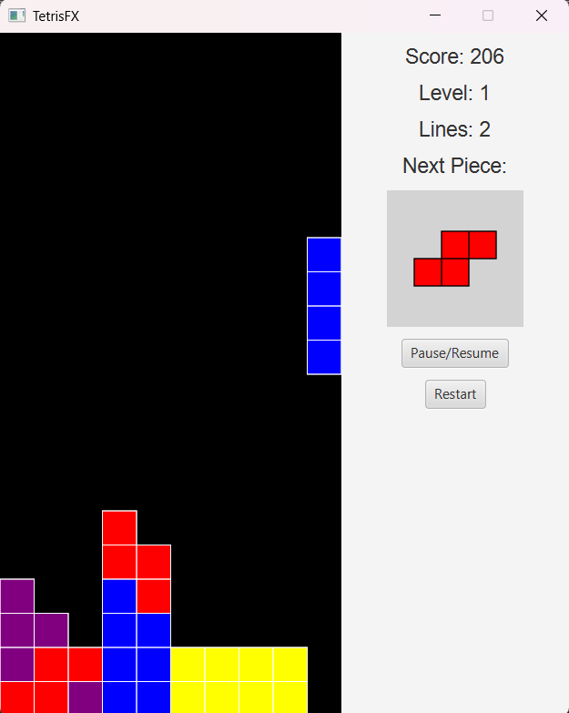
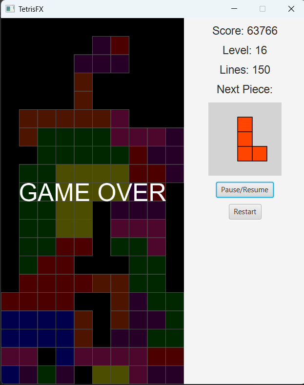

# Jogo Tetris em JavaFX

<div style="text-align: justify">Este projeto é uma implementação do clássico jogo Tetris utilizando Java e a biblioteca JavaFX para a interface gráfica. O objetivo principal foi desenvolver um código limpo, bem estruturado e documentado, aplicando conceitos sólidos de Programação Orientada a Objetos (POO) e Padrões de Design.</div>

<div style="display: flex; align-items: center; margin-left: 100px; margin-top: 20px">

  <a href="assets/PlayingTetrisGame.png">
    
  </a>


  <a href="assets/GameOverTetris.png">
    
  </a>

</div>


---
## Tecnologias Utilizadas
- **Linguagem:** Java (Compatível com JDK 11 ou superior)
- **Interface Gráfica:** JavaFX
- **IDE de Desenvolvimento:** IntelliJ IDEA
---
## Funcionalidades Implementadas

### Mecânicas Essenciais do Jogo
- **Geração Aleatória de Peças:** 7 tipos diferentes de Tetrominós (I, O, T, S, Z, J, L) são gerados aleatoriamente.
- **Movimento Completo:** As peças podem ser movidas para a esquerda, direita e para baixo (queda suave).
- **Rotação de Peças:** As peças podem ser rotacionadas no sentido horário.
- **Queda Rápida (Hard Drop):** O jogador pode fazer a peça cair instantaneamente.
- **Detecção de Colisões:** Sistema robusto que deteta colisões com as bordas do tabuleiro e com outras peças já fixadas.
- **Eliminação de Linhas:** Linhas horizontais completas são detectadas, eliminadas, e as linhas superiores descem.
- **Sistema de Pontuação Progressiva:**
    - Linha Simples: 40 pontos
    - Dupla: 100 pontos
    - Tripla: 300 pontos
    - Tetris (4 linhas): 1200 pontos
    - A pontuação é multiplicada pelo nível atual.

### Interface e Controles
- **Tabuleiro de Jogo:** Grelha clássica de 10x20 blocos.
- **Painel de Informações:** Exibe em tempo real a pontuação, o nível e o total de linhas eliminadas.
- **Pré-visualização da Próxima Peça:** Mostra qual será o próximo Tetrominó a entrar no jogo.
- **Controles do Jogo:**
    - **Setas Esquerda/Direita:** Mover a peça.
    - **Seta para Baixo:** Acelerar a queda da peça (soft drop).
    - **Seta para Cima:** Rotacionar a peça.
    - **Barra de Espaço:** Queda instantânea da peça (hard drop).
- **Controles da Janela:** Botões para Pausar/Continuar e para Reiniciar o jogo.
---
## Arquitetura do Projeto

A estrutura do projeto segue princípios de POO com uma clara separação de responsabilidades.

### Classes Principais (Modelo e Controlador)
- **`GameEngine`**: O cérebro do jogo. Orquestra o loop principal, gerencia os estados do jogo (jogando, pausado, fim de jogo), processa os comandos do utilizador e coordena a interação entre o tabuleiro e as peças.
- **`Board`**: Representa o tabuleiro 10x20. É responsável por armazenar as peças fixadas, detectar colisões e gerir a lógica de eliminação de linhas.
- **`Tetromino`**: Classe abstrata que serve de base para todas as peças. Define comportamentos comuns como rotação e movimento.
- **`IPiece`, `OPiece`, etc.**: Classes concretas que herdam de `Tetromino` e definem a forma e a cor específicas de cada peça.

### Classes de Interface (Visão)
- **`MainApp`**: Ponto de entrada da aplicação JavaFX. Monta a janela principal e os componentes visuais.
- **`GamePanel`**: Um `Canvas` JavaFX responsável por renderizar o tabuleiro, a peça em movimento e as peças já fixadas. Funciona com um loop de animação para garantir 60 FPS.
- **`InfoPanel`**: Um painel que exibe todas as informações textuais (pontuação, nível, linhas) e a pré-visualização da próxima peça.

### Padrões de Design Utilizados
- **Factory Method**: A classe `TetrominoFactory` é usada para criar instâncias de peças aleatórias, desacoplando a `GameEngine` da lógica de criação das peças concretas.
- **State**: O `enum GameState` (`PLAYING`, `PAUSED`, `GAME_OVER`) é usado para gerenciar e controlar o comportamento do jogo em diferentes situações, simplificando a lógica no `GameEngine`.
- **Observer**: As propriedades do JavaFX (`IntegerProperty`, `ObjectProperty`) são usadas extensivamente na `GameEngine` para notificar a `InfoPanel` sobre mudanças na pontuação, nível e próxima peça. Isso permite que a UI se atualize automaticamente sem acoplamento direto.

---

## Como Executar o Projeto

### Pré-requisitos Gerais
1. **JDK (Java Development Kit):** Versão 11 ou superior instalada em seu sistema.

2. **Git:** Para clonar o repositório.

### Passos para Configuração e Execução

<div style="text-align: justify">Este projeto utiliza o Maven para gerenciar suas dependências, o que o torna compatível com a maioria das IDEs Java modernas. Abaixo estão as instruções para IntelliJ IDEA, Visual Studio Code e Eclipse.</div>

---
### Executando no IntelliJ IDEA (Recomendado)

O IntelliJ IDEA oferece a integração mais fluida para projetos JavaFX com Maven.

1. **Clonar o Repositório:**

```Bash
  git clone https://github.com/diogoneriscwb/TetrisGame
```
2. **Abrir o Projeto:**

 - Na tela de boas-vindas do IntelliJ, selecione **Open**.

 - Navegue até a pasta do projeto clonado e a selecione. O IntelliJ detectará automaticamente o arquivo `pom.xml` e configurará o projeto como um projeto Maven.

 - Aguarde o Maven baixar as dependências (pode levar um minuto na primeira vez).

3. **Executar a Aplicação:**

 - No painel de projeto, navegue até `src/main/java`.

 - Encontre a classe `MainApp.java` dentro do seu pacote (ex: `com.tetris`).

 - Clique com o botão direito sobre ela e selecione **Run 'MainApp.main()'**.

---

### Executando no Visual Studio Code

O VS Code, com as extensões corretas, é uma excelente alternativa leve para desenvolver em Java.

1. **Instalar Extensões (Pré-requisito):**

  - Abra o VS Code e vá para a aba de Extensões (Ctrl+Shift+X).

  - Instale o **"Extension Pack for Java"** da Microsoft.

  - Instale a extensão "JavaFX Support" (ID: vscjava.vscode-javafx). Esta extensão é crucial, pois facilita a execução de aplicações JavaFX.

2. **Clonar o Repositório e Abrir a Pasta:**

```Bash
  git clone https://github.com/diogoneriscwb/TetrisGame
  cd <PASTA_DO_PROJETO>
  code .
```
  - Ou, no VS Code, vá em File > Open Folder... e selecione a pasta do projeto.

3. **Sincronizar o Projeto:**

  - Quando abrir a pasta, o VS Code detectará o `pom.xml`. Uma notificação no canto inferior direito pode perguntar se você confia no projeto. Clique em **Yes**.

  - Aguarde as extensões Java inicializarem e baixarem as dependências do Maven.

4. **Executar a Aplicação:**

  - Navegue até o arquivo `MainApp.java`.

  - Acima do método `public static void main(String[] args)`, você verá as opções **"Run"** e **"Debug"**.

  - Clique em Run para iniciar o jogo. A extensão de suporte ao JavaFX configurará a execução automaticamente.

---

### Executando no Eclipse IDE

O Eclipse também possui um forte suporte ao Maven, mas a configuração de execução para JavaFX pode exigir um passo manual.

1. **Clonar o Repositório:**

```Bash
  git clone https://github.com/diogoneriscwb/TetrisGame
```
2. **Importar o Projeto:**

  - Abra o Eclipse e vá em `File > Import...`.

  - Na janela de importação, selecione **Maven > Existing Maven Projects** e clique em **Next**.

  - Clique em **Browse...** e selecione a pasta raiz do projeto clonado (a que contém o `pom.xml`).

  - O Eclipse deve encontrar o projeto na lista. Certifique-se de que ele está marcado e clique em **Finish**.

  - Aguarde o Eclipse construir o workspace e baixar as dependências do Maven.

3. **Configurar a Execução (Passo Importante):**

  - Encontre a classe `MainApp.java` no "Package Explorer".

  - Clique com o botão direito sobre ela e vá em **Run As > Run Configurations...**.

  - Na janela que abrir, selecione a configuração de `MainApp` sob "Java Application".

  - Vá para a aba **(x)= Arguments**.

  - No campo **VM arguments**, você precisa adicionar as seguintes opções para informar ao Java onde encontrar os módulos do JavaFX. ***<Este é o passo que mais causa erros se não for feito>***.

```Bash
  --module-path /caminho/para/seu/repo/maven/org/openjfx --add-modules javafx.controls,javafx.graphics,javafx.fxml
````
  - **Como encontrar o caminho?** O `caminho/para/seu/repo/maven` geralmente é `C:\Users\SEU_USUARIO\.m2\repository`. Você precisará navegar até essa pasta e encontrar os JARs do `openjfx` para confirmar o caminho exato.

4. **Executar a Aplicação:**

  - Após configurar os argumentos da VM, clique em **Apply** e depois em **Run**.